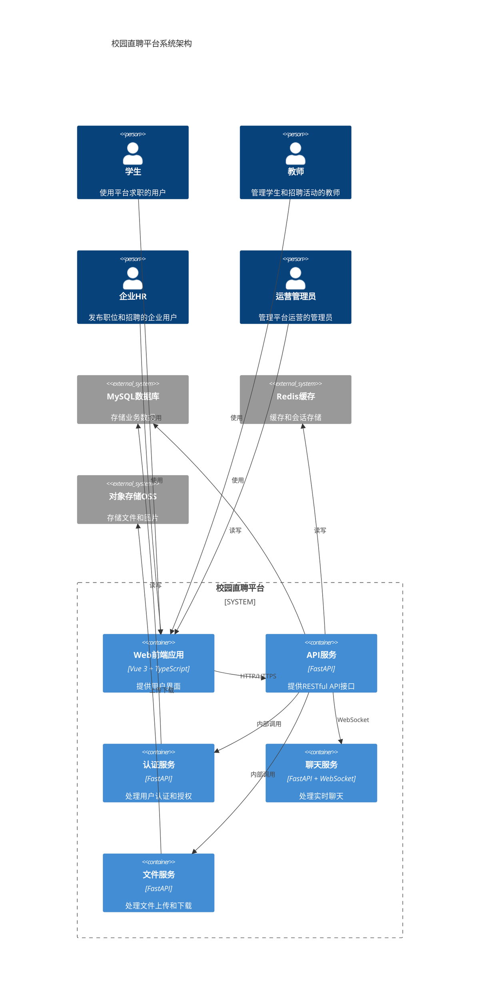

# 校园直聘平台 - 系统设计文档

## 概述

本文档描述校园直聘平台的高层架构设计、数据模型、API设计、错误处理和测试策略。

## 高层架构

### C4 Container 图



## 组件/服务职责表

| 组件/服务 | 职责 | 技术栈 |
|---------|------|--------|
| Web前端应用 | 提供用户界面，处理用户交互 | Vue 3 + TypeScript + Vite + TailwindCSS + Pinia |
| API服务 | 提供RESTful API接口，处理业务逻辑 | FastAPI + Python 3.11 |
| 认证服务 | 处理用户认证、授权、JWT令牌管理 | FastAPI + JWT |
| 聊天服务 | 处理实时聊天消息，WebSocket通信 | FastAPI + WebSocket |
| 文件服务 | 处理文件上传、下载、图片处理 | FastAPI + Aliyun OSS |
| MySQL数据库 | 存储业务数据 | MySQL 8.0 |
| Redis缓存 | 缓存热点数据，会话存储 | Redis |
| 对象存储OSS | 存储文件和图片 | Aliyun OSS |

## 数据模型

### Prisma Schema

```prisma
// 用户基础表
model User {
  id            String    @id @default(uuid())
  username      String    @unique
  phone         String?   @unique
  email         String?   @unique
  password_hash String
  user_type     UserType  // STUDENT, TEACHER, ENTERPRISE, ADMIN
  status        UserStatus @default(ACTIVE)
  created_at    DateTime  @default(now())
  updated_at    DateTime  @updatedAt
  
  // 关联关系
  student_profile    StudentProfile?
  teacher_profile    TeacherProfile?
  enterprise_profile EnterpriseProfile?
  admin_profile      AdminProfile?
  
  // 消息和聊天
  sent_messages      Message[]      @relation("SenderMessages")
  received_messages  Message[]      @relation("ReceiverMessages")
  chat_sessions      ChatSession[]  @relation("UserChatSessions")
  
  // 其他关联
  favorites          Favorite[]
  schedules          Schedule[]
  interviews         Interview[]
  job_applications   JobApplication[]
  
  @@index([username])
  @@index([phone])
  @@index([user_type])
}

enum UserType {
  STUDENT
  TEACHER
  ENTERPRISE
  ADMIN
}

enum UserStatus {
  ACTIVE
  INACTIVE
  BANNED
}

// 学生信息表
model StudentProfile {
  id              String   @id @default(uuid())
  user_id         String   @unique
  real_name       String
  student_id      String?  @unique
  school_id       String?
  department_id   String?
  class_id        String?
  grade           String?
  major           String?
  avatar_url      String?
  created_at      DateTime @default(now())
  updated_at      DateTime @updatedAt
  
  user            User     @relation(fields: [user_id], references: [id], onDelete: Cascade)
  school          School?  @relation(fields: [school_id], references: [id])
  department      Department? @relation(fields: [department_id], references: [id])
  class           Class?   @relation(fields: [class_id], references: [id])
  resumes         Resume[]
  job_intentions  JobIntention[]
  
  @@index([school_id])
  @@index([department_id])
}

// 教师信息表
model TeacherProfile {
  id              String   @id @default(uuid())
  user_id         String   @unique
  real_name       String
  school_id       String?
  department_id   String?
  title           String?
  avatar_url      String?
  is_main_account Boolean  @default(false)
  main_account_id String?
  created_at      DateTime @default(now())
  updated_at      DateTime @updatedAt
  
  user            User     @relation(fields: [user_id], references: [id], onDelete: Cascade)
  school          School?  @relation(fields: [school_id], references: [id])
  department      Department? @relation(fields: [department_id], references: [id])
  
  @@index([school_id])
  @@index([main_account_id])
}

// 企业信息表
model EnterpriseProfile {
  id              String   @id @default(uuid())
  user_id         String   @unique
  company_name    String
  unified_code    String?  @unique
  legal_person    String?
  industry        String?
  scale           String?
  address         String?
  website         String?
  logo_url        String?
  description     String?  @db.Text
  is_verified     Boolean  @default(false)
  is_main_account Boolean  @default(false)
  main_account_id String?
  created_at      DateTime @default(now())
  updated_at      DateTime @updatedAt
  
  user            User     @relation(fields: [user_id], references: [id], onDelete: Cascade)
  jobs            Job[]
  job_fairs       JobFair[]
  info_sessions   InfoSession[]
  
  @@index([company_name])
  @@index([is_verified])
}

// 学校表
model School {
  id          String   @id @default(uuid())
  name        String   @unique
  code        String?  @unique
  province    String?
  city        String?
  address     String?
  website     String?
  logo_url    String?
  description String?  @db.Text
  is_verified Boolean  @default(false)
  created_at  DateTime @default(now())
  updated_at  DateTime @updatedAt
  
  departments Department[]
  students    StudentProfile[]
  teachers    TeacherProfile[]
  
  @@index([name])
}

// 院系表
model Department {
  id          String   @id @default(uuid())
  school_id   String
  name        String
  code        String?
  description String?  @db.Text
  created_at  DateTime @default(now())
  updated_at  DateTime @updatedAt
  
  school      School   @relation(fields: [school_id], references: [id], onDelete: Cascade)
  classes     Class[]
  students    StudentProfile[]
  teachers    TeacherProfile[]
  
  @@unique([school_id, name])
  @@index([school_id])
}

// 班级表
model Class {
  id            String   @id @default(uuid())
  department_id String
  name          String
  grade         String?
  created_at    DateTime @default(now())
  updated_at    DateTime @updatedAt
  
  department    Department @relation(fields: [department_id], references: [id], onDelete: Cascade)
  students      StudentProfile[]
  
  @@unique([department_id, name])
  @@index([department_id])
}

// 简历表
model Resume {
  id              String   @id @default(uuid())
  student_id      String
  title           String
  content         String   @db.Text
  is_default      Boolean  @default(false)
  view_count      Int      @default(0)
  download_count  Int      @default(0)
  created_at      DateTime @default(now())
  updated_at      DateTime @updatedAt
  
  student         StudentProfile @relation(fields: [student_id], references: [id], onDelete: Cascade)
  job_applications JobApplication[]
  favorites       Favorite[]
  
  @@index([student_id])
  @@index([is_default])
}

// 职位表
model Job {
  id              String   @id @default(uuid())
  enterprise_id   String
  title           String
  department      String?
  job_type        String?
  salary_min      Int?
  salary_max      Int?
  work_location   String?
  experience      String?
  education       String?
  description     String   @db.Text
  requirements    String?  @db.Text
  status          JobStatus @default(DRAFT)
  view_count      Int      @default(0)
  apply_count     Int      @default(0)
  tags            String?
  created_at      DateTime @default(now())
  updated_at      DateTime @updatedAt
  
  enterprise      EnterpriseProfile @relation(fields: [enterprise_id], references: [id], onDelete: Cascade)
  applications    JobApplication[]
  favorites       Favorite[]
  
  @@index([enterprise_id])
  @@index([status])
  @@index([created_at])
  @@fulltext([title, description])
}

enum JobStatus {
  DRAFT
  PENDING
  PUBLISHED
  CLOSED
}

// 求职意向表
model JobIntention {
  id              String   @id @default(uuid())
  student_id      String
  job_type        String?
  industry        String?
  salary_expect   Int?
  work_location   String?
  created_at      DateTime @default(now())
  updated_at      DateTime @updatedAt
  
  student         StudentProfile @relation(fields: [student_id], references: [id], onDelete: Cascade)
  
  @@index([student_id])
}

// 职位申请表
model JobApplication {
  id          String   @id @default(uuid())
  job_id      String
  resume_id   String
  student_id  String
  status      ApplicationStatus @default(PENDING)
  message     String?  @db.Text
  created_at  DateTime @default(now())
  updated_at  DateTime @updatedAt
  
  job         Job      @relation(fields: [job_id], references: [id], onDelete: Cascade)
  resume      Resume   @relation(fields: [resume_id], references: [id], onDelete: Cascade)
  user        User     @relation(fields: [student_id], references: [id], onDelete: Cascade)
  interview   Interview?
  
  @@unique([job_id, student_id])
  @@index([job_id])
  @@index([student_id])
  @@index([status])
}

enum ApplicationStatus {
  PENDING
  VIEWED
  INTERVIEWED
  ACCEPTED
  REJECTED
}

// 双选会表
model JobFair {
  id              String   @id @default(uuid())
  school_id       String?
  title           String
  description     String?  @db.Text
  start_time      DateTime
  end_time        DateTime
  location        String?
  status          JobFairStatus @default(DRAFT)
  max_enterprises Int?
  created_by      String?
  created_at      DateTime @default(now())
  updated_at      DateTime @updatedAt
  
  school          School?  @relation(fields: [school_id], references: [id])
  enterprise      EnterpriseProfile? @relation(fields: [created_by], references: [id])
  registrations   JobFairRegistration[]
  schedules       Schedule[]
  
  @@index([school_id])
  @@index([status])
  @@index([start_time])
}

enum JobFairStatus {
  DRAFT
  PENDING
  PUBLISHED
  ENDED
}

// 双选会报名表
model JobFairRegistration {
  id          String   @id @default(uuid())
  job_fair_id String
  enterprise_id String
  status      RegistrationStatus @default(PENDING)
  check_in_time DateTime?
  created_at  DateTime @default(now())
  
  job_fair    JobFair  @relation(fields: [job_fair_id], references: [id], onDelete: Cascade)
  enterprise  EnterpriseProfile @relation(fields: [enterprise_id], references: [id], onDelete: Cascade)
  
  @@unique([job_fair_id, enterprise_id])
  @@index([job_fair_id])
  @@index([enterprise_id])
}

enum RegistrationStatus {
  PENDING
  APPROVED
  REJECTED
  CHECKED_IN
}

// 宣讲会表
model InfoSession {
  id              String   @id @default(uuid())
  enterprise_id   String
  school_id       String?
  title           String
  description     String?  @db.Text
  start_time      DateTime
  end_time        DateTime
  location        String?
  session_type    SessionType @default(OFFLINE)
  live_url        String?
  status          SessionStatus @default(DRAFT)
  max_students    Int?
  check_in_count  Int      @default(0)
  created_at      DateTime @default(now())
  updated_at      DateTime @updatedAt
  
  enterprise      EnterpriseProfile @relation(fields: [enterprise_id], references: [id], onDelete: Cascade)
  school          School?  @relation(fields: [school_id], references: [id])
  registrations   InfoSessionRegistration[]
  schedules       Schedule[]
  
  @@index([enterprise_id])
  @@index([school_id])
  @@index([status])
  @@index([start_time])
}

enum SessionType {
  OFFLINE
  ONLINE
  LIVE
}

enum SessionStatus {
  DRAFT
  PENDING
  PUBLISHED
  ENDED
}

// 宣讲会报名表
model InfoSessionRegistration {
  id              String   @id @default(uuid())
  session_id      String
  student_id      String
  status          RegistrationStatus @default(PENDING)
  check_in_time   DateTime?
  created_at      DateTime @default(now())
  
  session         InfoSession @relation(fields: [session_id], references: [id], onDelete: Cascade)
  student         StudentProfile @relation(fields: [student_id], references: [id], onDelete: Cascade)
  
  @@unique([session_id, student_id])
  @@index([session_id])
  @@index([student_id])
}

// 面试表
model Interview {
  id              String   @id @default(uuid())
  application_id  String   @unique
  enterprise_id   String
  student_id      String
  interview_type  InterviewType @default(VIDEO)
  scheduled_time  DateTime
  duration        Int?
  location        String?
  meeting_url     String?
  status          InterviewStatus @default(SCHEDULED)
  feedback        String?  @db.Text
  created_at      DateTime @default(now())
  updated_at      DateTime @updatedAt
  
  application     JobApplication @relation(fields: [application_id], references: [id], onDelete: Cascade)
  enterprise      EnterpriseProfile @relation(fields: [enterprise_id], references: [id])
  student         StudentProfile @relation(fields: [student_id], references: [id])
  schedule        Schedule?
  
  @@index([enterprise_id])
  @@index([student_id])
  @@index([status])
  @@index([scheduled_time])
}

enum InterviewType {
  VIDEO
  VOICE
  OFFLINE
}

enum InterviewStatus {
  SCHEDULED
  IN_PROGRESS
  COMPLETED
  CANCELLED
}

// 聊天会话表
model ChatSession {
  id              String   @id @default(uuid())
  user1_id        String
  user2_id        String
  last_message_at DateTime @default(now())
  created_at      DateTime @default(now())
  updated_at      DateTime @updatedAt
  
  user1           User     @relation("UserChatSessions", fields: [user1_id], references: [id])
  user2           User     @relation("UserChatSessions", fields: [user2_id], references: [id])
  messages        Message[]
  
  @@unique([user1_id, user2_id])
  @@index([user1_id])
  @@index([user2_id])
  @@index([last_message_at])
}

// 消息表
model Message {
  id              String   @id @default(uuid())
  session_id      String
  sender_id       String
  receiver_id     String
  content         String   @db.Text
  message_type    MessageType @default(TEXT)
  file_url        String?
  is_read         Boolean  @default(false)
  created_at      DateTime @default(now())
  
  session         ChatSession @relation(fields: [session_id], references: [id], onDelete: Cascade)
  sender          User     @relation("SenderMessages", fields: [sender_id], references: [id])
  receiver        User     @relation("ReceiverMessages", fields: [receiver_id], references: [id])
  
  @@index([session_id])
  @@index([sender_id])
  @@index([receiver_id])
  @@index([created_at])
}

enum MessageType {
  TEXT
  IMAGE
  FILE
  LOCATION
  SYSTEM
}

// 收藏表
model Favorite {
  id          String   @id @default(uuid())
  user_id     String
  target_type FavoriteType
  target_id   String
  created_at  DateTime @default(now())
  
  user        User     @relation(fields: [user_id], references: [id], onDelete: Cascade)
  
  @@unique([user_id, target_type, target_id])
  @@index([user_id])
  @@index([target_type, target_id])
}

enum FavoriteType {
  JOB
  RESUME
  SCHOOL
  STUDENT
  ENTERPRISE
}

// 日程表
model Schedule {
  id              String   @id @default(uuid())
  user_id         String
  title           String
  content         String?  @db.Text
  start_time      DateTime
  end_time        DateTime?
  schedule_type   ScheduleType
  related_id      String?
  reminder_time   DateTime?
  is_completed    Boolean  @default(false)
  created_at      DateTime @default(now())
  updated_at      DateTime @updatedAt
  
  user            User     @relation(fields: [user_id], references: [id], onDelete: Cascade)
  
  @@index([user_id])
  @@index([start_time])
  @@index([schedule_type, related_id])
}

enum ScheduleType {
  JOB_FAIR
  INFO_SESSION
  INTERVIEW
  MANUAL
}

// Offer表
model Offer {
  id              String   @id @default(uuid())
  application_id  String   @unique
  enterprise_id   String
  student_id      String
  job_title       String
  salary          Int?
  start_date      DateTime?
  content         String   @db.Text
  status          OfferStatus @default(PENDING)
  expires_at      DateTime?
  created_at      DateTime @default(now())
  updated_at      DateTime @updatedAt
  
  application     JobApplication @relation(fields: [application_id], references: [id], onDelete: Cascade)
  enterprise      EnterpriseProfile @relation(fields: [enterprise_id], references: [id])
  student         StudentProfile @relation(fields: [student_id], references: [id])
  
  @@index([enterprise_id])
  @@index([student_id])
  @@index([status])
}

enum OfferStatus {
  PENDING
  ACCEPTED
  REJECTED
  EXPIRED
}

// 权益表
model Rights {
  id              String   @id @default(uuid())
  name            String   @unique
  code            String   @unique
  description     String?  @db.Text
  type            RightsType
  value           Int?
  is_active       Boolean  @default(true)
  created_at      DateTime @default(now())
  updated_at      DateTime @updatedAt
  
  packages        RightsPackageItem[]
  user_rights     UserRights[]
  
  @@index([code])
  @@index([type])
}

enum RightsType {
  FEATURE
  QUOTA
  DURATION
}

// 权益套餐表
model RightsPackage {
  id              String   @id @default(uuid())
  name            String   @unique
  description     String?  @db.Text
  price           Decimal  @db.Decimal(10, 2)
  duration_days   Int?
  is_active       Boolean  @default(true)
  created_at      DateTime @default(now())
  updated_at      DateTime @updatedAt
  
  items           RightsPackageItem[]
  purchases       RightsPurchase[]
  
  @@index([is_active])
}

// 权益套餐项表
model RightsPackageItem {
  id              String   @id @default(uuid())
  package_id      String
  rights_id       String
  quantity        Int      @default(1)
  created_at      DateTime @default(now())
  
  package         RightsPackage @relation(fields: [package_id], references: [id], onDelete: Cascade)
  rights          Rights        @relation(fields: [rights_id], references: [id], onDelete: Cascade)
  
  @@unique([package_id, rights_id])
  @@index([package_id])
}

// 用户权益表
model UserRights {
  id              String   @id @default(uuid())
  user_id         String
  rights_id       String
  quantity        Int      @default(0)
  expires_at      DateTime?
  created_at      DateTime @default(now())
  updated_at      DateTime @updatedAt
  
  user            User     @relation(fields: [user_id], references: [id], onDelete: Cascade)
  rights          Rights   @relation(fields: [rights_id], references: [id], onDelete: Cascade)
  
  @@unique([user_id, rights_id])
  @@index([user_id])
  @@index([expires_at])
}

// 权益购买表
model RightsPurchase {
  id              String   @id @default(uuid())
  user_id         String
  package_id      String
  amount          Decimal  @db.Decimal(10, 2)
  status          PurchaseStatus @default(PENDING)
  created_at      DateTime @default(now())
  updated_at      DateTime @updatedAt
  
  package         RightsPackage @relation(fields: [package_id], references: [id])
  user            User     @relation(fields: [user_id], references: [id])
  
  @@index([user_id])
  @@index([status])
}

enum PurchaseStatus {
  PENDING
  PAID
  FAILED
  REFUNDED
}

// 反馈建议表
model Feedback {
  id              String   @id @default(uuid())
  user_id         String
  user_type       UserType
  title           String
  content         String   @db.Text
  images          String?
  status          FeedbackStatus @default(PENDING)
  reply           String?  @db.Text
  replied_at      DateTime?
  created_at      DateTime @default(now())
  updated_at      DateTime @updatedAt
  
  user            User     @relation(fields: [user_id], references: [id], onDelete: Cascade)
  
  @@index([user_id])
  @@index([status])
  @@index([created_at])
}

enum FeedbackStatus {
  PENDING
  PROCESSING
  RESOLVED
  REJECTED
}
```

## REST API 设计

### OpenAPI 3.1 规范

```yaml
openapi: 3.1.0
info:
  title: 校园直聘平台 API
  version: 1.0.0
  description: 校园直聘平台RESTful API文档

servers:
  - url: http://localhost:5001/api/v1
    description: 开发环境
  - url: https://api.college-zhaopin.com/api/v1
    description: 生产环境

tags:
  - name: 认证
    description: 用户认证相关接口
  - name: 用户
    description: 用户信息管理
  - name: 职位
    description: 职位管理
  - name: 简历
    description: 简历管理
  - name: 聊天
    description: 在线聊天
  - name: 宣讲会
    description: 宣讲会管理
  - name: 双选会
    description: 双选会管理
  - name: 面试
    description: 面试管理
  - name: 权益
    description: 权益管理

paths:
  # 认证相关
  /auth/register:
    post:
      tags: [认证]
      summary: 用户注册
      requestBody:
        required: true
        content:
          application/json:
            schema:
              $ref: '#/components/schemas/RegisterRequest'
      responses:
        '201':
          description: 注册成功
        '400':
          description: 请求参数错误
        '409':
          description: 用户已存在

  /auth/login:
    post:
      tags: [认证]
      summary: 用户登录
      requestBody:
        required: true
        content:
          application/json:
            schema:
              $ref: '#/components/schemas/LoginRequest'
      responses:
        '200':
          description: 登录成功
          content:
            application/json:
              schema:
                $ref: '#/components/schemas/LoginResponse'
        '401':
          description: 用户名或密码错误

  /auth/refresh:
    post:
      tags: [认证]
      summary: 刷新令牌
      security:
        - bearerAuth: []
      responses:
        '200':
          description: 刷新成功
          content:
            application/json:
              schema:
                $ref: '#/components/schemas/TokenResponse'

  # 用户相关
  /users/me:
    get:
      tags: [用户]
      summary: 获取当前用户信息
      security:
        - bearerAuth: []
      responses:
        '200':
          description: 成功
          content:
            application/json:
              schema:
                $ref: '#/components/schemas/UserResponse'

  # 职位相关
  /jobs:
    get:
      tags: [职位]
      summary: 获取职位列表
      parameters:
        - name: page
          in: query
          schema:
            type: integer
            default: 1
        - name: page_size
          in: query
          schema:
            type: integer
            default: 20
        - name: keyword
          in: query
          schema:
            type: string
        - name: location
          in: query
          schema:
            type: string
      responses:
        '200':
          description: 成功
          content:
            application/json:
              schema:
                $ref: '#/components/schemas/JobListResponse'
    post:
      tags: [职位]
      summary: 创建职位
      security:
        - bearerAuth: []
      requestBody:
        required: true
        content:
          application/json:
            schema:
              $ref: '#/components/schemas/JobCreateRequest'
      responses:
        '201':
          description: 创建成功

  /jobs/{job_id}:
    get:
      tags: [职位]
      summary: 获取职位详情
      parameters:
        - name: job_id
          in: path
          required: true
          schema:
            type: string
      responses:
        '200':
          description: 成功
          content:
            application/json:
              schema:
                $ref: '#/components/schemas/JobResponse'

  # 简历相关
  /resumes:
    get:
      tags: [简历]
      summary: 获取简历列表
      security:
        - bearerAuth: []
      parameters:
        - name: student_id
          in: query
          schema:
            type: string
      responses:
        '200':
          description: 成功
    post:
      tags: [简历]
      summary: 创建简历
      security:
        - bearerAuth: []
      requestBody:
        required: true
        content:
          application/json:
            schema:
              $ref: '#/components/schemas/ResumeCreateRequest'
      responses:
        '201':
          description: 创建成功

components:
  securitySchemes:
    bearerAuth:
      type: http
      scheme: bearer
      bearerFormat: JWT

  schemas:
    RegisterRequest:
      type: object
      required:
        - username
        - password
        - user_type
      properties:
        username:
          type: string
        password:
          type: string
        phone:
          type: string
        email:
          type: string
        user_type:
          type: string
          enum: [STUDENT, TEACHER, ENTERPRISE, ADMIN]

    LoginRequest:
      type: object
      required:
        - username
        - password
      properties:
        username:
          type: string
        password:
          type: string

    LoginResponse:
      type: object
      properties:
        access_token:
          type: string
        refresh_token:
          type: string
        token_type:
          type: string
          default: bearer

    TokenResponse:
      type: object
      properties:
        access_token:
          type: string
        token_type:
          type: string
          default: bearer

    UserResponse:
      type: object
      properties:
        id:
          type: string
        username:
          type: string
        user_type:
          type: string

    JobCreateRequest:
      type: object
      required:
        - title
        - description
      properties:
        title:
          type: string
        description:
          type: string
        department:
          type: string
        salary_min:
          type: integer
        salary_max:
          type: integer

    JobResponse:
      type: object
      properties:
        id:
          type: string
        title:
          type: string
        description:
          type: string
        enterprise:
          type: object

    JobListResponse:
      type: object
      properties:
        items:
          type: array
          items:
            $ref: '#/components/schemas/JobResponse'
        total:
          type: integer
        page:
          type: integer
        page_size:
          type: integer

    ResumeCreateRequest:
      type: object
      required:
        - title
        - content
      properties:
        title:
          type: string
        content:
          type: string
        is_default:
          type: boolean
```

## 错误处理

### 统一异常码

| 错误码 | HTTP状态码 | 说明 |
|--------|-----------|------|
| 1000 | 400 | 请求参数错误 |
| 1001 | 400 | 参数缺失 |
| 1002 | 400 | 参数格式错误 |
| 2000 | 401 | 未授权 |
| 2001 | 401 | 令牌无效 |
| 2002 | 401 | 令牌过期 |
| 2003 | 403 | 权限不足 |
| 3000 | 404 | 资源不存在 |
| 4000 | 409 | 资源冲突 |
| 4001 | 409 | 用户已存在 |
| 5000 | 500 | 服务器内部错误 |
| 5001 | 500 | 数据库错误 |

### 错误响应格式

```json
{
  "error_code": 1000,
  "error_message": "请求参数错误",
  "detail": "字段 'username' 不能为空"
}
```

### 日志规范

- 使用结构化日志格式（JSON）
- 记录级别：DEBUG, INFO, WARNING, ERROR, CRITICAL
- 关键操作记录操作日志（用户ID、操作类型、操作时间、IP地址）
- 错误日志包含堆栈信息

## 测试策略

### 单元测试

- **后端**: 使用Pytest，目标覆盖率 > 80%
- **前端**: 使用Vitest，目标覆盖率 > 70%
- 测试业务逻辑、工具函数、API路由

### 集成测试

- 测试API接口的完整流程
- 测试数据库操作
- 测试第三方服务集成（OSS、短信等）

### E2E测试

- 使用Playwright进行端到端测试
- 测试关键业务流程：
  - 用户注册登录流程
  - 职位发布和申请流程
  - 聊天功能流程
  - 宣讲会/双选会流程

### 测试覆盖率目标

- 单元测试覆盖率: > 80%
- 集成测试覆盖率: > 60%
- E2E测试覆盖率: > 40%


